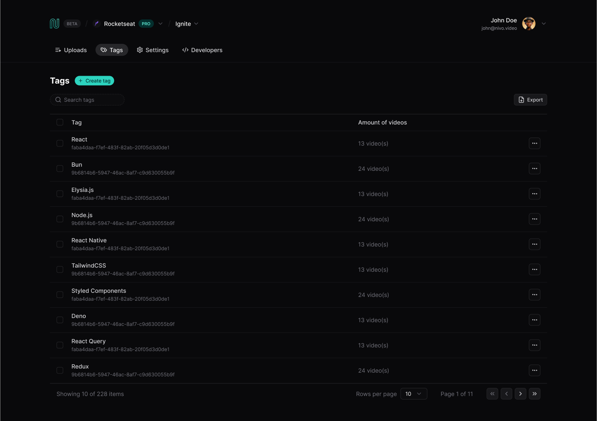
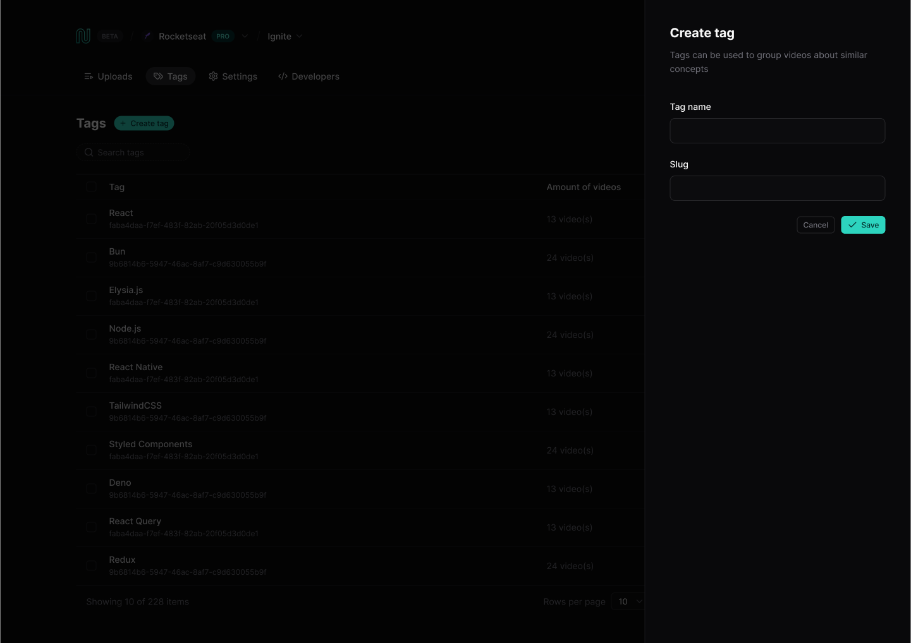

# React na Prática

## Sobre

Projeto criado durante o evento "React na Prática" da Rocketseat 🚀, para treinar conceitos intermediários e avançados na construção de aplicações com React.

Criamos um projeto totalmente do zero, desde a UI (User Interface/Interface do Usuário) até funcionalidades diferenciais, como filtros, paginação e ordenação.

## Telas

### Listagem de dados

  

### Formulário de cadastro

  

## Funcionalidades

Principais funcionalidades desenvolvidas:

- **Listagem de dados:** criamos uma interface de listagem de produtos no formato de tabela utilizando paginação.
- **Formulário com relacionamentos:** criamos um formulário completo que permite o cadastro de um produto e, ao mesmo tempo, permite conectarmos o usuário a uma ou mais categorias que podem ser criadas enquanto estamos criando o produto.

## Tecnologias

As principais tecnologias escolhidas para desenvolver esse projeto forem:
- `React`
- `React Query`
- `React Hook Form`
- `TailwindCSS`
- `shadcn/ui`
